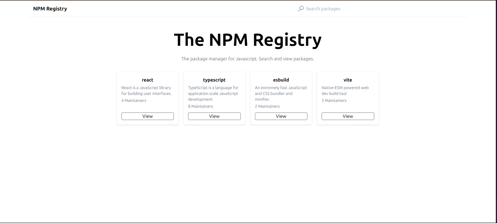

# Package Hub

A modern web application for exploring and searching NPM packages. View it live at [Package Hub](https://thedevdevesh-package-hub.netlify.app/).



## Features

- 🏠 **Homepage with Featured Packages**: Displays a curated list of popular NPM packages
- 🔍 **Package Search**: Search through the entire NPM registry
- 📦 **Package Details**: View detailed information about any NPM package
- 💅 **Modern UI**: Built with Tailwind CSS for a clean, responsive interface
- 🚀 **Fast Performance**: Built with Vite for lightning-fast development and production builds

## Technologies Used

- React 18
- TypeScript
- Vite
- React Router Dom
- Tailwind CSS
- React Icons
- NPM Registry API

## Getting Started

### Prerequisites

- Node.js (v16 or higher)
- npm or yarn

### Installation

1. Clone the repository
```bash
git clone https://github.com/thedevdevesh/PackageHub.git
cd package-hub
```

2. Install dependencies
```bash
npm install
# or
yarn install
```

3. Start the development server
```bash
npm run dev
# or
yarn dev
```

4. Open [http://localhost:5173](http://localhost:5173) in your browser

## Available Scripts

- `npm run dev` - Start development server
- `npm run build` - Build for production
- `npm run lint` - Run ESLint
- `npm run preview` - Preview production build locally

## Project Structure

```
package-hub/
├── src/
│   ├── api/         # API integration
│   ├── components/  # Reusable components
│   ├── pages/       # Page components and loaders
│   └── App.tsx      # Main application component
├── public/          # Static assets
└── ...config files
```

## Contributing

1. Fork the repository
2. Create a new branch (`git checkout -b feature/amazing-feature`)
3. Commit your changes (`git commit -m 'Add some amazing feature'`)
4. Push to the branch (`git push origin feature/amazing-feature`)
5. Open a Pull Request

## Deployment

This project is deployed on Netlify. The live version can be accessed at:
[https://thedevdevesh-package-hub.netlify.app/](https://thedevdevesh-package-hub.netlify.app/)

To deploy your own instance:

1. Build the project:
```bash
npm run build
```

2. Deploy the `dist` folder to your preferred hosting platform (Netlify, Vercel, etc.)

